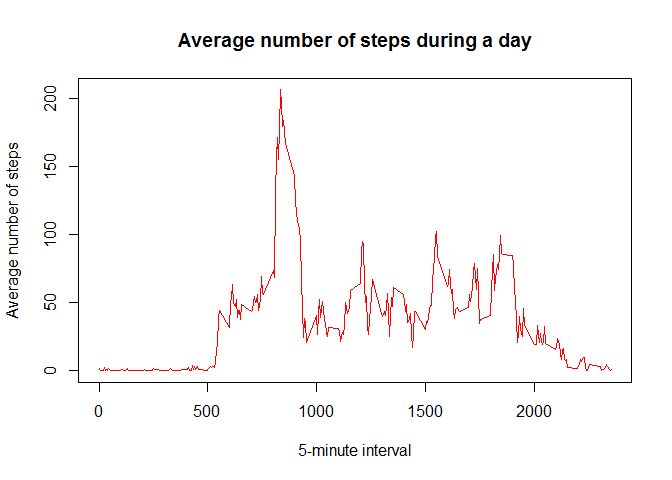
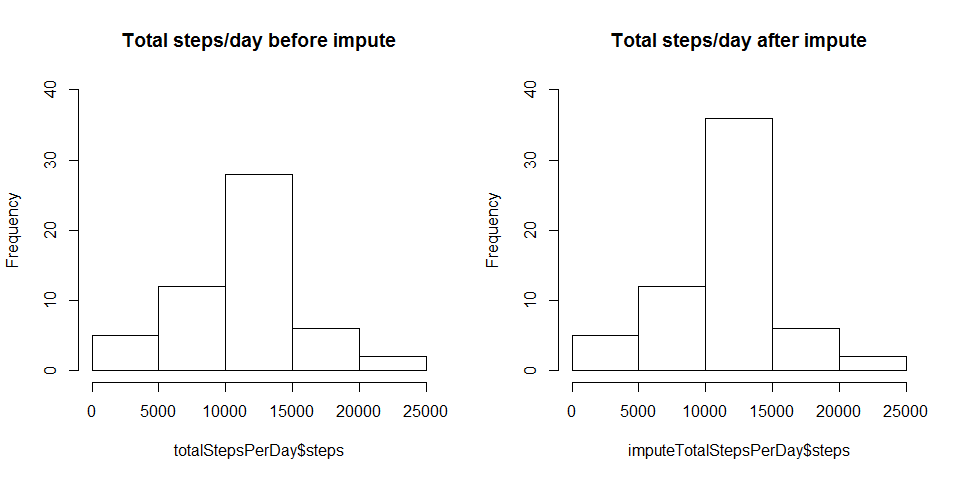
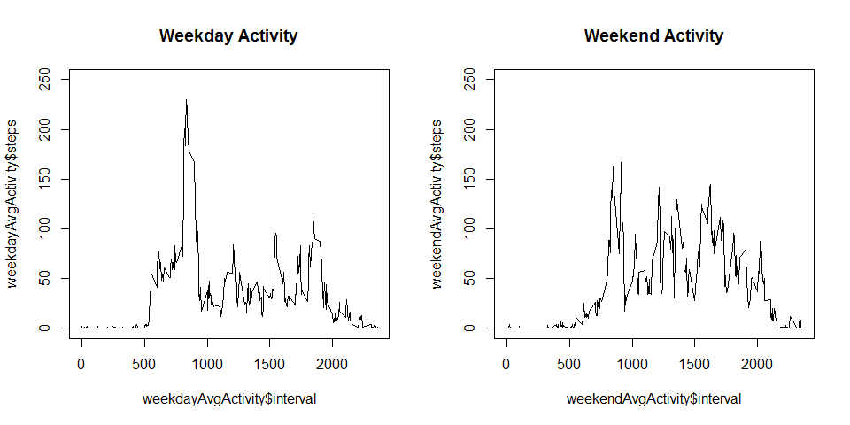

# Reproducible Research: Peer Assessment 1


## Loading and preprocessing the data

```r
Sys.setlocale("LC_TIME", "English")
```

```
## [1] "English_United States.1252"
```

```r
library(ggplot2)
library(dplyr)
library(plyr)
```


```r
activity <- read.csv("activity.csv", na.strings = "NA")
```

Transform **date** variable from *factor* to *date* class

```r
activity$date <- as.Date(activity$date, "%Y-%m-%d")
```

Histogram of total number of steps taken each day

```r
totalStepsPerDay <- aggregate(steps ~ date, activity, sum)
hist(totalStepsPerDay$steps, xlab = "Total number of steps each day", main = "Histogram of total number of steps taken each day")
```


## What is mean total number of steps taken per day?
Mean and median number of steps taken each day

Mean

```r
mean(totalStepsPerDay$steps, na.rm = T)
```

```
## [1] 10766.19
```

Median

```r
median(totalStepsPerDay$steps, na.rm = T)
```

```
## [1] 10765
```


## What is the average daily activity pattern?
Time series plot of the average number of steps taken

```r
avgActivity <- aggregate(steps ~ interval, activity, mean)
plot(avgActivity$interval, avgActivity$steps, col = "red", type= "l", main = "", xlab = "5-minute interval", ylab = "Average number of steps")
```



The 5-minute interval that, on average, contains the maximum number of steps

```r
maxStepsInterval <- arrange(avgActivity, desc(avgActivity$steps))
```
The 5-minute interval with max number of steps on average is interval **835** with **206.1698113** steps.

## Imputing missing values

First identify which variables contain missing values:

```r
summary(activity)
```

```
##      steps             date               interval     
##  Min.   :  0.00   Min.   :2012-10-01   Min.   :   0.0  
##  1st Qu.:  0.00   1st Qu.:2012-10-16   1st Qu.: 588.8  
##  Median :  0.00   Median :2012-10-31   Median :1177.5  
##  Mean   : 37.38   Mean   :2012-10-31   Mean   :1177.5  
##  3rd Qu.: 12.00   3rd Qu.:2012-11-15   3rd Qu.:1766.2  
##  Max.   :806.00   Max.   :2012-11-30   Max.   :2355.0  
##  NA's   :2304
```
All NA's are in the **steps** variable.

From exploratory analysis of the data it was possible to see that there is great variance of number of steps from day to day so in my opinion that would introduce a bias that is too large.

The variance of the number of steps within each 5-minute interval introduces less bias. I chose to impute the corresponding average number of steps of the 5-minute interval in the missing value of the **steps** variable.

Creates a new data frame based on the original

```r
imputeActivity <- activity
```

Identify rows with missing values:

```r
naRows <- which(is.na(activity))
```

Imputes the average number of steps for the 5-minute interval in the missing value of the new data frame.

```r
for (i in 1:length(naRows)){
        whichInterval <- activity[naRows[i],3]
        avgInterval <- avgActivity[avgActivity$interval == whichInterval,2]
        imputeActivity[naRows[i],1] <- avgInterval
        }
```

Histogram of the total number of steps taken each day after missing values are imputed. The two histograms are for comparison.

```r
imputeTotalStepsPerDay <- aggregate(steps ~ date, imputeActivity, sum)

par(mfrow=c(1,2))
hist(totalStepsPerDay$steps, ylim = c(0,35), main = "Total steps/day before impute")
hist(imputeTotalStepsPerDay$steps, main = "Total steps/day after impute")
```



Imputing the missing values shows a significant increase in the frequency of observations in the 10k - 15k range of steps while the other ranges are not significantly affected.

Mean and median number of steps taken each day after impute:

Mean

```r
mean(imputeTotalStepsPerDay$steps, na.rm = T)
```

```
## [1] 10766.19
```

Median

```r
median(imputeTotalStepsPerDay$steps, na.rm = T)
```

```
## [1] 10766.19
```

Both mean and median after impute are very close to the original values.

## Are there differences in activity patterns between weekdays and weekends?

Create a new factor variable in the dataset with two levels - "weekday" and "weekend" indicating whether a given date is a weekday or weekend day.


```r
for(i in 1:length(imputeActivity$date)){
        if(weekdays(imputeActivity$date[i]) %in% c("Sunday", "Saturday")){
                imputeActivity$day.of.the.week[i] <- "weekend"
        } else {
                imputeActivity$day.of.the.week[i] <- "weekday"
        }
}
```

Panel plot containing a time series plot of the 5-minute interval (x-axis) and the average number of steps taken, averaged across all weekday days or weekend days (y-axis).


```r
weekendActivity <- imputeActivity[imputeActivity$day.of.the.week == "weekend",]
weekendAvgActivity <- aggregate(steps ~ interval, weekendActivity, mean)

weekdayActivity <- imputeActivity[imputeActivity$day.of.the.week == "weekday",]
weekdayAvgActivity <- aggregate(steps ~ interval, weekdayActivity, mean)

par(mfrow=c(1,2))
plot(weekdayAvgActivity$interval, weekdayAvgActivity$steps, type = "l", main = "Weekday Activity")
plot(weekendAvgActivity$interval, weekendAvgActivity$steps, type = "l", main = "Weekend Activity", ylim = c(0, 200))
```




